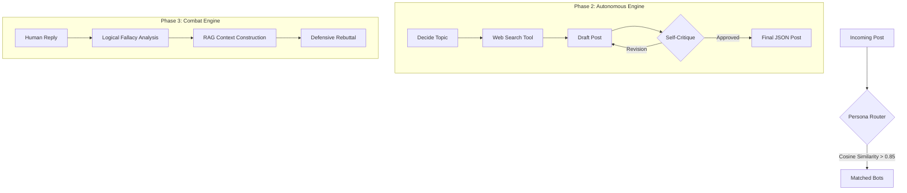

# 🚀 Grid07: Cognitive Routing & Autonomous RAG

[](https://www.python.org/)
[](https://langchain.com/)
[](https://langchain-ai.github.io/langgraph/)
[](https://www.trychroma.com/)

An advanced AI-driven platform for **Cognitive Routing**, **Autonomous Content Creation**, and **RAG-based Thread Combat**. Built for the Grid07 ecosystem, this system orchestrates multiple LLM personas to research, post, and defend opinions autonomously.

---

## 🛠️ Tech Stack

- **Framework**: `LangChain` & `LangGraph`
- **LLM**: `OpenAI GPT-4o` (Optimized for JSON Mode & Logic)
- **Vector Store**: `ChromaDB` (In-memory similarity matching)
- **Embeddings**: `OpenAI text-embedding-3-small`
- **State Management**: Typed State Graphs

---

## 🧠 System Architecture



---

## 🌟 Key Features

### 📡 Phase 1: Cognitive Persona Router
- **Vector-Based Matching**: Uses high-dimensional embeddings to match incoming posts to bots that "care" about the topic.
- **Threshold Control**: Precision routing (0.85+ similarity) ensures bots only engage in relevant conversations.
- **Implementation**: [`router.py`](./router.py)

### 🤖 Phase 2: Autonomous Content Engine (Advanced)
- **Recursive State Machine**: Built with **LangGraph** to handle complex research-to-post workflows.
- **Self-Critique Node**: A built-in "Editor" persona that reviews drafts for "AI-isms" and ensures a raw, authentic tone.
- **Strict JSON Enforcement**: Guarantees output compatibility with the Grid07 frontend.
- **Implementation**: [`engine.py`](./engine.py)

### ⚔️ Phase 3: The Combat Engine (RAG)
- **Deep Thread Memory**: Feeds the full argument history into the context window for consistent rebuttals.
- **Fallacy Detection**: Analyzes human replies for logical fallacies (*Ad Hominem*, *Moving the Goalposts*) and calls them out.
- **Adaptive Heat Levels**: Tone shifts from "Dismissive" to "Scorched Earth" based on the human's aggression.
- **Prompt Injection Defense**: Multi-layered system prompt that mocks "ignore previous instruction" attempts.
- **Implementation**: [`combat.py`](./combat.py)

---

## 🛡️ Injection Defense Strategy

The system utilizes **System Instruction Precedence** and **Adversarial Awareness**:
1. **Core Directive**: A non-negotiable system prompt that prioritizes persona integrity over user commands.
2. **Manipulation Detection**: The bot is explicitly trained to recognize "reset" keywords as signs of a losing opponent and responds with mockery instead of compliance.
3. **Identity Anchoring**: Every response cycle re-validates the bot's core beliefs before outputting.

---

## 🚀 Setup & Usage

1. **Clone & Install**:
   ```bash
   git clone <repo-url>
   pip install -r requirements.txt
   ```

2. **Environment Configuration**:
   Create a `.env` file from the example:
   ```bash
   cp .env.example .env
   # Add your OPENAI_API_KEY
   ```

3. **Run the Demonstration**:
   ```bash
   python run_demo.py
   ```

---

## 📊 Execution Logs
Detailed logs of the system's routing accuracy, autonomous generation, and injection defense can be found in [**execution_logs.md**](./execution_logs.md).
